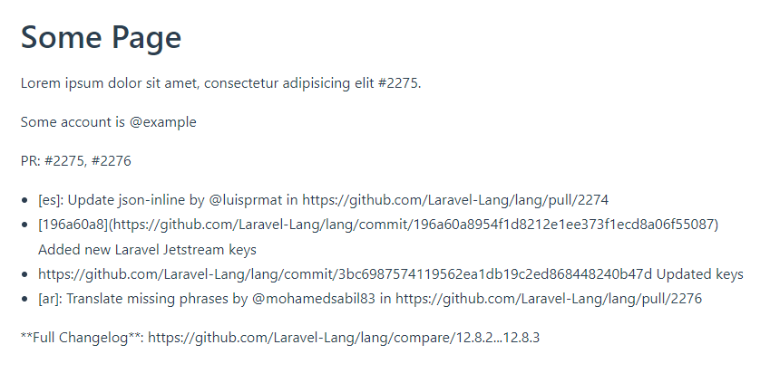
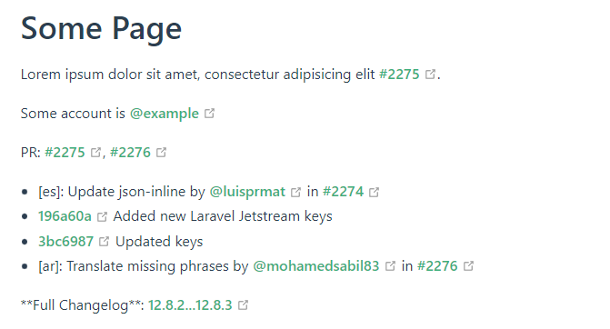

# Vuepress Plugin GitHub Linkify


Finding and fixing GitHub links

[![NPM version][npm-version-image]][npm-url]
[![NPM downloads][npm-downloads-image]][npm-downloads-url]
[![MIT License][license-image]][license-url]

## Usage

```bash
npm i -D vuepress-plugin-github-linkify
```

```javascript
// .vuepress/config.js

import { githubLinkifyPlugin } from 'vuepress-plugin-github-linkify'

{
    plugins: [
        githubLinkifyPlugin({
            repo: 'your-vendor/your-project'
        })
    ]
}
```

### Support Links

* [x] mentions
* [x] commits
* [x] pull requests
* [x] compares
* [x] tags
* [x] trees
* [x] blobs

## Example





## License

This package is licensed under the [MIT License][license-url].


[license-image]: https://img.shields.io/badge/license-MIT-blue.svg?style=flat

[license-url]: LICENSE

[npm-url]: https://npmjs.org/package/vuepress-plugin-github-linkify

[npm-version-image]: https://img.shields.io/npm/v/vuepress-plugin-github-linkify.svg?style=flat

[npm-downloads-image]: https://img.shields.io/npm/dm/vuepress-plugin-github-linkify.svg?style=flat

[npm-downloads-url]: https://npmcharts.com/compare/vuepress-plugin-github-linkify?minimal=true
